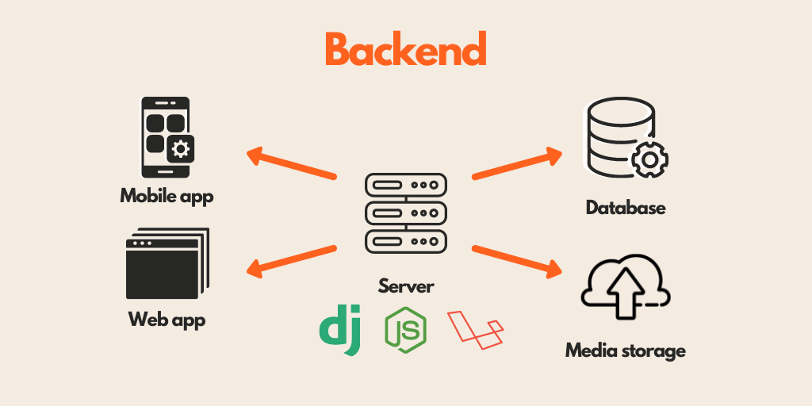
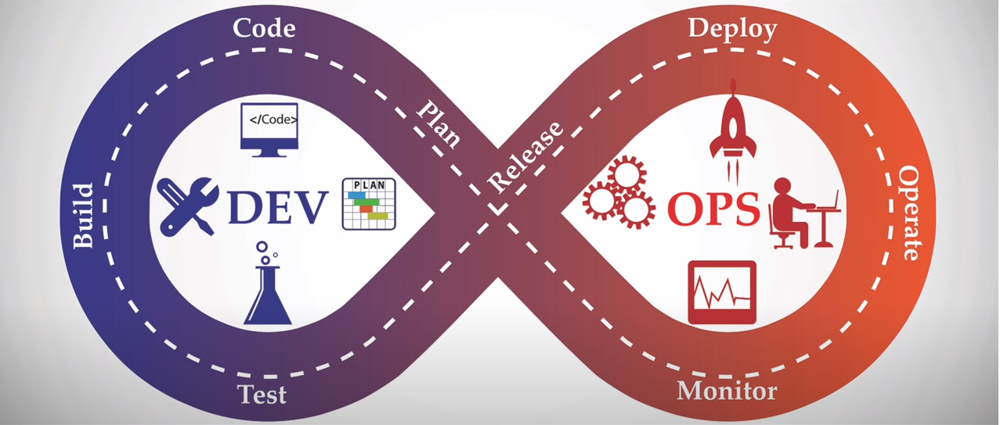

#   
# **Fullstack Development**
---

#   
* ## **풀스택 개발이란**
* ## **풀스택 개발자의 역할과 필요한 기술 스택**
---

#   
## 풀스택 개발이란?
##### Frontend, Backend 그리고 DevOps 파트 모든 소프트웨어 스택을 일컫는 말로 풀스택 개발자란 이 모든 것을 담당하는 개발자
---

#    
## 풀스택 개발자의 역할과 필요 기술 스택
---

### ***Frontend 개발***
##### 유저 인터페이스(UI)와 사용자 경험(UX) 개발
##### Client 사이드의 모든 버튼, 입력 폼, 애니메이션, 반응형 디자인 등
* ##### **_HTML, CSS, Javascript + React, JQuery, VueJS_**
##### 
---
 
### ***Backend 개발***
##### 사용자에게 보이지 않는 (Back) 동작기능 구현
##### 서버사이드 로직 개발, DB관리, API개발
* ##### **_PHP, Java, Python, Javascript, C# + Node.js, Django, Ruby on Rails_**
* ##### **_MySQL, MongoDB, RESTful API_**
##### 
---

### ***DevOps (Deployment + Operations)***
* ##### 개발완료 👉 서비스 및 유지보수 👉 서버에 올리고 설정 / 운영
* ##### SW개발과 운영프로세스 간 협업과 통합을 강조하는 개발방법론
* ##### SW의 빠른 제공과 안정적인 운영환경을 실현
##### 
---

### ***결론***
##### Full Stack Developer = 모든 것을 다 하는 사람
##### 1. Client Form을 만들어서,
##### 2. Server 및 데이터베이스에 저장하고,
##### 3. 구현한 시스템을 서비스 + 운영하는 것.
### **1인 기업👀**

###  모두 다 마스터 할 필요는 없다. ❌
### 다만 무엇인지는 알아야 한다. ⭕